[linkedin](https://linkedin.com/) &nbsp;·&nbsp;
[github](https://github.com/isthatabbhi) &nbsp;·&nbsp;
[email](mailto:contact@example.com)

> CS student at Jain University, in Bangalore. 
> Small, sharp tools over big vague ideas.

Skilled in AWS, Azure Data Factory, Databricks, PySpark. 
Focus: cloud native engineering, IaC, data pipelines. 
Pursuing MCA in Cloud Tech.

<samp>aws &nbsp; azure &nbsp; pyspark &nbsp; databricks &nbsp; python &nbsp; sql &nbsp; cdk &nbsp; docker &nbsp; fabric &nbsp; linux &nbsp; git</samp>

**[aws-cdk-pipeline](https://github.com/)** &nbsp;·&nbsp; <samp>aws cdk, typescript, python</samp> 
Infrastructure-as-code CI/CD pipeline with dev/prod isolation, built on CDK, 
CodePipeline, CodeBuild, CodeDeploy, CloudFormation, EC2, S3, IAM, and CloudWatch.

**[pc-control-panel](https://github.com/)** &nbsp;·&nbsp; <samp>python, flask, websockets</samp> 
Flask and WebSocket server controlling system volume, brightness, power plans, 
Wi-Fi, and Bluetooth on Windows, driven remotely from an iOS Scriptable UI.

<samp>AWS Academy Cloud Architecting &nbsp;·&nbsp; Databricks GenAI &nbsp;·&nbsp; Oracle OCI AI Foundations 
CompTIA Cloud+ (in progress) &nbsp;·&nbsp; Google Python &nbsp;·&nbsp; Meta MySQL &nbsp;·&nbsp; Anthropic MCP</samp>

Every graphic here is generated, not embedded from anyone else's server. 
`ascii.svg` is a photo pushed through a character ramp by 
[`scripts/make_portrait.py`](scripts/make_portrait.py); the stat graphics and 
these section headings are drawn by [a scheduled action](.github/workflows/stats.yml) 
straight from the GitHub GraphQL API, once a day, committing only what changed.

They animate with SMIL inside the SVG, because GitHub strips scripts from 
READMEs — and since nothing loads from a third party, nothing here can 
rate-limit or go dark. The headings are SVGs for the same reason: GitHub also 
strips CSS, so an image is the only way to put this page's own typeface on them.

The typeface is [JetBrains Mono](scripts/fonts), subset to just the characters 
each graphic draws and inlined as base64. That isn't only for looks: the 
portrait's grid assumes an advance width of exactly 0.600 em, and a viewer whose 
default monospace is narrower would otherwise see it squeezed.

Language totals cover public repositories only. `year.svg` uses the portrait's 
character ramp: `:` `+` `#` `@`, quiet to loud.
